# Computer-Vision-Projects
Projects from Computer Vision course.
Most of the code in the last two projects isn't written by me.

## Mosaic Generation
<table>
  <tr>
    <td width="50%">
      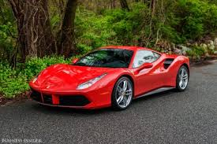 
    </td>
    <td width="50%">
       
    </td>
  </tr>
</table>

## Content-Aware Resizing
<table>
  <tr>
    <td width="33%">
       
    </td>
    <td width="33%">
      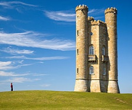 
    </td>
    <td width="33%">
      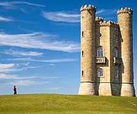 
    </td>
  </tr>
</table>

## Texture Synthesis and Transfer 	 		
<table>
  <tr>
    <td width="25%">
      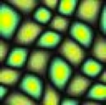 
    </td>
    <td width="25%">
      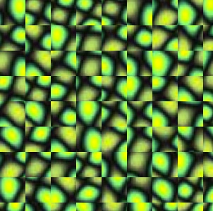 
    </td>
    <td width="25%">
      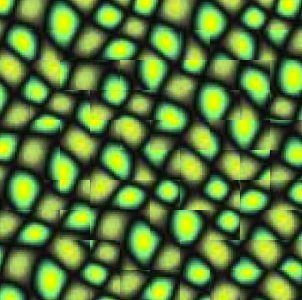 
    </td>
    <td width="25%">
      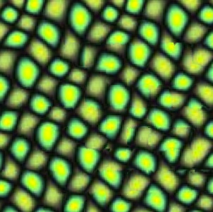 
    </td>
  </tr>
  <tr>
    <td width="33%">
      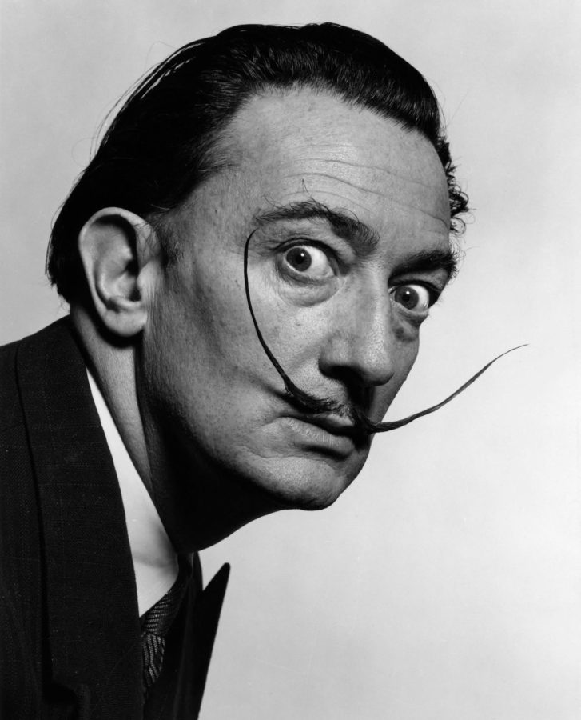 
    </td>
    <td width="33%">
       
    </td>
    <td width="33%">
      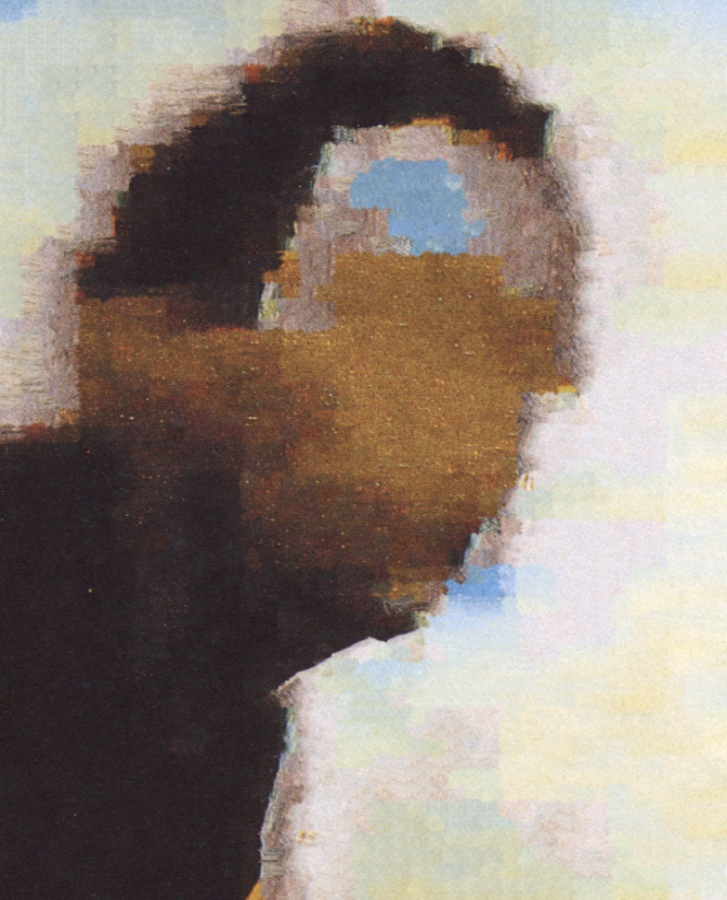 
    </td>
  </tr>
  <tr>
    <td width="33%">
      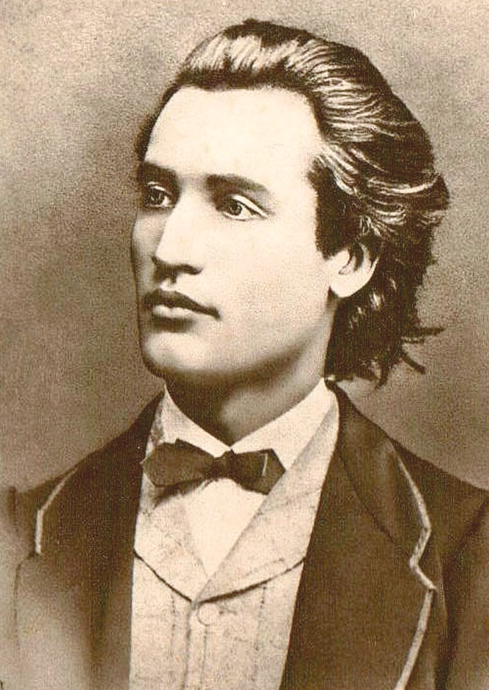 
    </td>
    <td width="33%">
      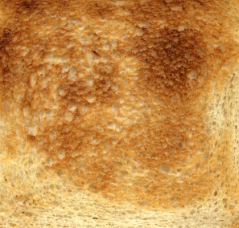 
    </td>
    <td width="33%">
      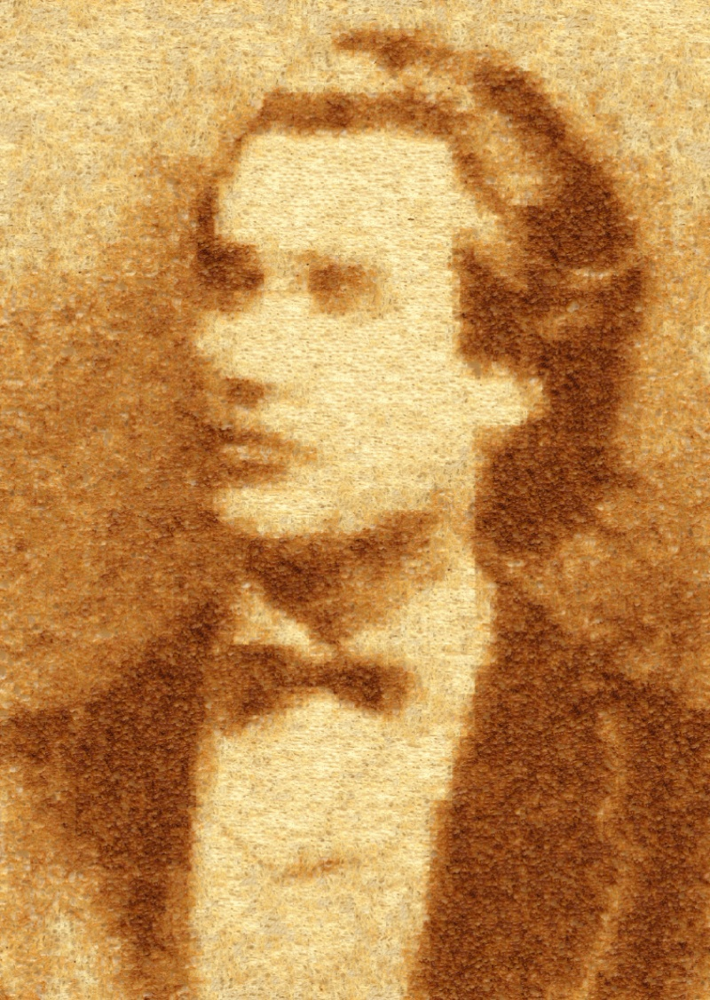 
    </td>
  </tr>
</table>

## Facial Detection
<table>
  <tr>
    <td width="50%">
      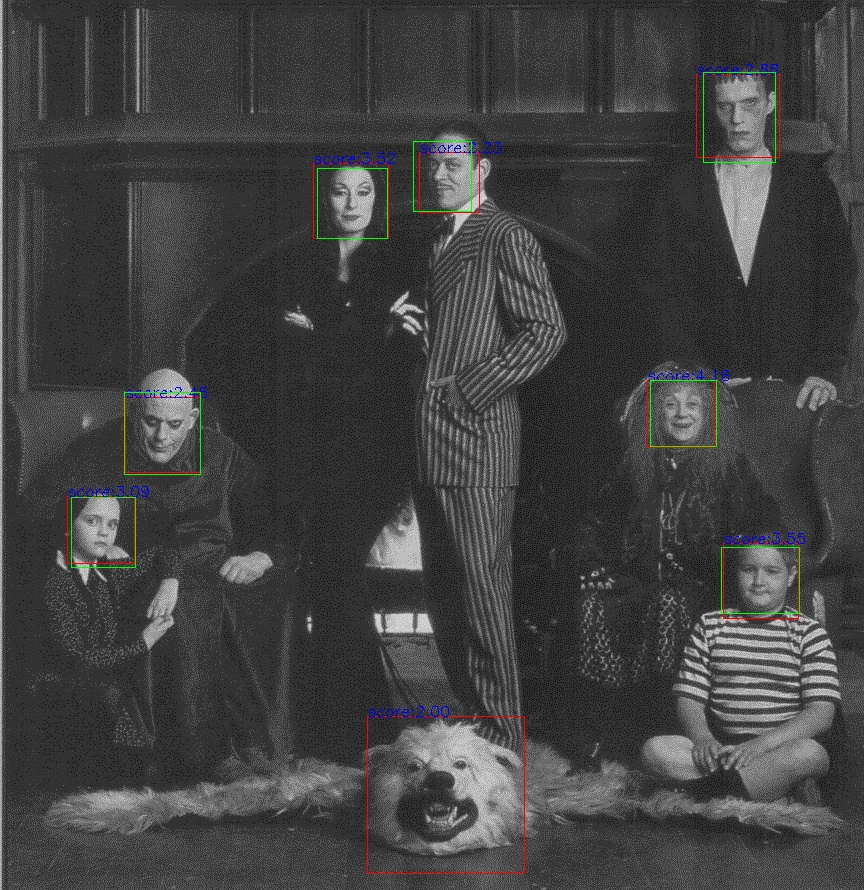 
    </td>
    <td width="50%">
      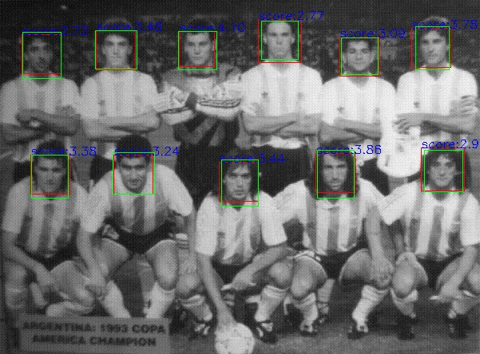 
    </td>
  </tr>
</table>

## Image Colorization
<table>
  <tr>
    <td width="33%">
      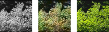 
    </td>
    <td width="33%">
      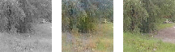 
    </td>
    <td width="33%">
      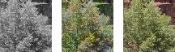 
    </td>
  </tr>
</table>
